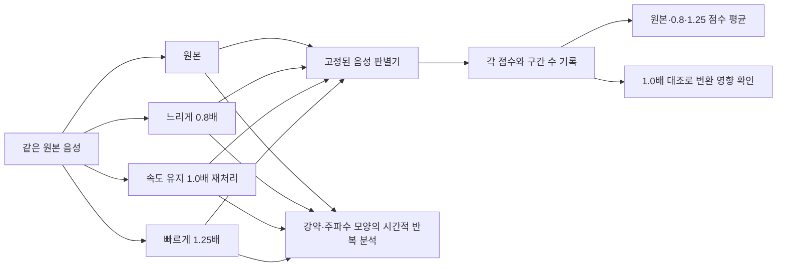
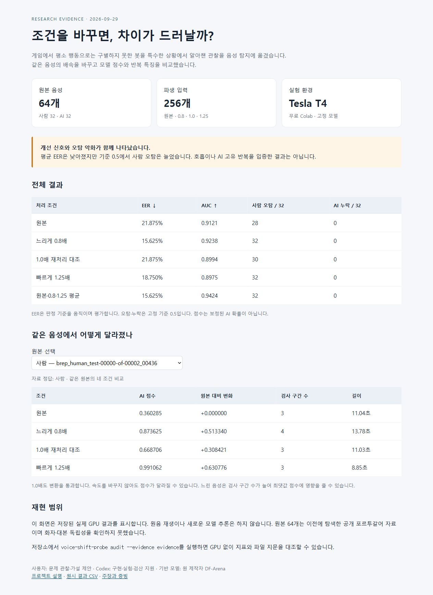

# Voice Shift Probe

[](https://github.com/7065616b/voice-shift-probe/actions/workflows/verify.yml)

**게임에서 봇을 알아채는 관찰을 음성 탐지 실험으로 옮긴 프로젝트.** 같은 소리를 느리게·빠르게 처리했을 때, 사람과 AI 음성을 구별하는 단서가 드러나는지 비교합니다.

이 저장소의 최종 연구 구현은 **원본 / 0.8배 / 1.0배 재처리 / 1.25배를 비교하는 탐지 래퍼 v0.1**입니다. 사전 학습된 DF-Arena의 음성 판별기를 고정하고, 세 조건의 점수를 평균하는 후보와 시간적 반복 특징을 함께 관찰합니다. 새 대형 신경망을 학습하지 않았으며, 배포용 판별 기준은 검증하지 않았습니다.

## 출발한 질문

축구 게임에서 평소 패스는 잘 막던 상대가 일직선으로 달리는 상황에서는 대응하지 않는 것을 보고 봇이라고 의심한 경험에서 출발했습니다.

> 평상시에는 구별하기 어려운 사람과 AI가, 조건을 바꾸면 서로 다르게 반응할까?

여기에 “합성 음성에는 호흡과 강약의 자연스러운 변화가 부족해 보인다”는 청취 가설을 연결했습니다. 그 가설을 곧바로 정답 규칙으로 사용하지 않고, 배속을 바꾸어 반복 특징과 탐지 점수의 변화를 측정했습니다. **호흡 구간을 주석 처리하거나 호흡 탐지기를 학습한 것은 아닙니다.**

## 구현 흐름



- 음높이를 유지하는 FFmpeg `atempo`로 배속을 변경합니다.
- 1.0배도 변환 과정을 통과시켜, 속도 변화와 처리 과정의 영향을 구분합니다.
- 반복 간격을 원래 시간 기준으로 환산합니다.
- 특징 분석은 해석을 위한 진단입니다. 반복 특징을 AI 점수 평균에 학습·결합하지 않습니다.
- 약 4.04초 구간 점수의 최댓값을 사용하는 기존 판별 방식과 검사 구간 수를 기록합니다.

## 관찰 결과

2026-09-29 무료 Colab Tesla T4에서 실행한 **원본 64개**를 사용했습니다. 사람 32개, F5-TTS 16개, YourTTS 16개이며, 네 조건의 입력 256개는 같은 원본에서 파생된 자료입니다. 256개의 독립 음성이 아닙니다.

| 조건 | EER ↓ | AUC ↑ | 사람 오탐 / 32 | AI 누락 / 32 |
|---|---:|---:|---:|---:|
| 원본 | 21.875% | 0.9121 | 28 | 0 |
| 0.8배 | 15.625% | 0.9238 | 32 | 0 |
| 1.0배 재처리 대조 | 21.875% | 0.8994 | 30 | 0 |
| 1.25배 | 18.750% | 0.8975 | 32 | 0 |
| 원본·0.8·1.25 동일 가중 평균 | 15.625% | 0.9424 | 32 | 0 |

오탐·누락 기준은 사전에 고정한 0.5입니다. EER은 판정 기준을 움직이며 오탐률과 누락률이 만나는 지점을 평가하므로 고정 기준의 오류율과 다릅니다. **평균의 EER은 개선됐지만 사람 오탐은 악화됐습니다.** 1.0배 재처리만으로도 오탐이 늘었으므로, 모든 변화를 AI의 고유 특징이라고 해석할 수 없습니다.

강약 반복은 일부 생성기에서 더 컸지만 사람과 다른 생성기의 분포는 겹쳤습니다. 주파수별 반복도 공통된 분리 기준을 제공하지 않았습니다. 이번 결과로 호흡 부족이나 AI 고유 반복을 입증하지 않았습니다.

## 바로 확인하기 — GPU 없이

Python 3.11 이상에서:

```bash
python -m pip install -e .
voice-shift-probe audit --evidence evidence
python -m unittest discover -s tests -v
```

검산 명령은 저장된 256행의 점수로 EER·AUC·오탐을 다시 계산하고 원시 JSON/CSV, 실험 조건 및 파일 지문을 대조합니다. GPU와 원본 음원 다운로드가 필요 없습니다. 변환 통합 테스트에는 별도로 FFmpeg가 필요합니다.

[파일별 결과를 보는 화면](demo/index.html)은 내려받아 브라우저에서 열 수 있습니다. 로컬 미리보기는 `python -m http.server 8000` 실행 후 `http://localhost:8000/demo/`로 접속합니다.

## 새 음성에 연구 모델 실행하기

FFmpeg, CUDA GPU, [별도 GPU 환경](requirements-gpu.txt), 원 제작자의 기본 실행 폴더가 필요합니다. 저장소에 모델 가중치와 대회 기본 코드를 재배포하지 않습니다.

```bash
voice-shift-probe predict \
  --audio /path/to/voice.wav \
  --baseline-dir /path/to/baseline_run \
  --out runs/probe.json
```

`baseline_run`에는 원 제작자의 `script.py`, `model/df_arena_1b/` 코드·설정·가중치가 있어야 합니다. 필요한 구조와 해시는 [모델 카드](docs/model-card.md)에 있습니다. GPU 환경과 파일은 사용자가 별도로 준비하며, 추론 중 자동 다운로드·결제는 하지 않습니다. 4096표본보다 짧은 입력은 거부합니다.

출력에는 조건별 점수, 검사 구간 수, 반복 특징, 점수 평균, 1.0배 대조의 변화가 들어갑니다. 점수는 보정된 AI 확률이 아니며 `decision`은 비워 둡니다. **새 래퍼의 실제 GPU 추론은 이번 공개 정리 과정에서 다시 실행하지 않았습니다.** 과거 GPU 결과의 재검산과 변환·결합 동작 검증 범위를 구분합니다.

## 증빙으로 확인할 것

| 자료 | 확인할 수 있는 내용 |
|---|---|
| [원시 점수](evidence/frozen/results.csv) | 파일별 4조건의 점수와 검사 구간 수 |
| [결과를 보기 전 고정한 실험 조건](evidence/frozen/protocol.json) | 배속, 판정 기준, 평균식, 분석 범위 |
| [원본 출처와 위치](evidence/frozen/source_locators.json) | 데이터 리비전, 파일·행 위치, 원본 해시 |
| [모델·환경 기록](evidence/frozen/results.json) | 가중치 해시, 모델 코드 해시, GPU 환경 |
| [원래 실행한 코드](evidence/frozen/gpu_inference.py) | 2026-09-29 실험을 실행한 구현 |
| [자동 검증](.github/workflows/verify.yml) | 저장된 수치를 다시 계산하고 변환·결합 동작 검사 |
| [주장과 근거의 대응표](docs/evidence-guide.md) | 무엇을 검증했고 무엇은 미확인인지 |

파일 해시는 기록의 변경을 검사하는 수단이며 실험 실행을 제삼자가 인증했다는 뜻은 아닙니다. GitHub CI도 원래 GPU 실험을 다시 실행하는 작업이 아닙니다.

로컬 공개 준비 검증: [9개 테스트와 3개 원본·12조건의 변환 재생 기록](evidence/release_verification.json). 12조건은 실제 PCM을 대조하고 저장된 모델 점수를 재사용했습니다. 새 GPU 추론 결과가 아닙니다.

<details>
<summary>파일별 결과 화면 미리보기</summary>



</details>

## 기여와 한계

사용자는 게임 행동 관찰, 호흡 단서, 배속 변화 가설을 제안했습니다. 코드 구현·실험 실행·검산·문서화에는 Codex의 지원을 사용했습니다. DF-Arena 신경망과 가중치는 원 제작자의 기여이며 직접 개발한 모델로 주장하지 않습니다.

- 이전에 탐색한 포르투갈어 자료이며 독립 검증 세트가 아닙니다. 화자·대본의 독립성도 확인하지 못했습니다.
- 원음을 음성 판별기에 직접 넣는 실험입니다. 음원 분리·음악 판별까지 포함한 전체 파이프라인의 결과가 아닙니다.
- 배속에 따라 검사 구간 수와 최댓값 집계가 달라집니다. 점수 변화의 원인을 배속 하나로 단정할 수 없습니다.
- 평균 후보의 검사 구간 수는 697회로 원본 229회의 약 3.04배입니다.
- 사람 오탐이 늘어난 후보를 실사용 개선 모델로 채택하지 않았습니다.

다음 검증은 새로운 화자·생성기, 다른 배속 변환 방식, 동일한 검사 구간 수를 사용한 비교입니다. [포트폴리오 소개문](docs/portfolio.md) · [모델 카드](docs/model-card.md) · [외부 구성요소 출처](THIRD_PARTY_NOTICES.md)
